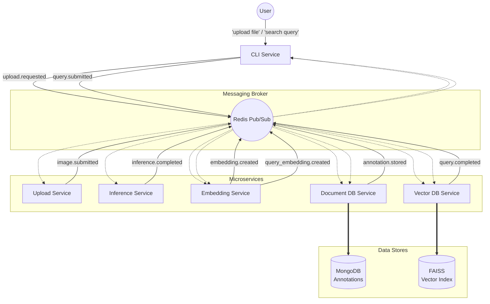

# Event-Driven Image Annotation and Retrieval System

## Overview
The Event-Driven Image Annotation and Retrieval System is a modular, asynchronous pipeline that processes images, detects objects, and allows users to search for images using natural language. It utilizes a publish-subscribe (Pub/Sub) messaging architecture to decouple services, MongoDB for flexible document storage, FAISS for high-performance vector search, and the Google Gemini API for object detection and semantic embeddings.

## Video link 
[YOUTUBE LINK](https://youtu.be/FWJb-_6TxbA)

## Key Features
* **Asynchronous Event-Driven Architecture**: Fully decoupled microservices communicate via Redis Pub/Sub, ensuring non-blocking operations and system scalability.
* **Automated Object Detection**: Integrates with Gemini 2.5 Flash to automatically detect bounding boxes and labels for objects within uploaded images.
* **Semantic Vector Search**: Uses Gemini embedding models and a FAISS index to find images based on the semantic meaning of natural language queries, rather than just keyword matching.
* **Flexible Document Storage**: Employs MongoDB to store evolving, nested annotation data without being constrained by rigid relational schemas.
* **Fault Tolerance & Idempotency**: Designed to handle duplicate events, dropped messages, and out-of-order processing through strategic state management and event generation testing.
* **Interactive CLI**: A command-line interface to upload images, track background processing notifications, and submit search queries.

## Prerequisites
* **Python**: 3.10 or higher.
* **Database Servers**: Local or cloud instances of **Redis** (for messaging) and **MongoDB** (for document storage).
* **API Key**: A [Google AI Studio](https://aistudio.google.com/) API key for Gemini.

## Installation & Setup

1. **Clone the repository**
   ```bash
   git clone https://github.com/akerkork/image-retrieval-project
   cd image-retrieval-project
   ```

2. **Create and activate a virtual environment**
   * **Windows**:
     ```powershell
     python -m venv venv
     .\venv\Scripts\Activate.ps1
     ```
   * **macOS/Linux**:
     ```bash
     python3 -m venv venv
     source venv/bin/activate
     ```

3. **Install dependencies**
   ```bash
   pip install -r requirements.txt
   ```

4. **Start Backend Infrastructure**
   Ensure Redis and MongoDB are running. You can easily start them using Docker:
   ```bash
   docker run -d -p 6379:6379 redis:7-alpine
   docker run -d -p 27017:27017 mongo:latest
   ```

5. **Set your Gemini API Key**
   Export your API key as an environment variable so the application can authenticate with Google's servers.
   * **Windows (PowerShell)**:
     ```powershell
     $env:GEMINI_API_KEY="your_api_key_here"
     ```
   * **macOS/Linux**:
     ```bash
     export GEMINI_API_KEY="your_api_key_here"
     ```

## Usage

Because this is a distributed system, you will need to start the background services before interacting with the CLI. Open multiple terminal windows (with your virtual environment activated and API key set in each) to run the following:

**Start the Background Services:**
```bash
python -m src.upload_service.service
python -m src.inference_service.service
python -m src.document_db_service.service
python -m src.embedding_service.service
python -m src.vector_db_service.service
```

**Start the Interactive CLI:**
```bash
python -m src.cli_service.service
```

### Example Workflow
1. **Upload an Image**: In the CLI, type `upload sample_test.jpg`. The CLI will dispatch the event, and you will see terminal output from the background services as the image is copied, analyzed by Gemini, and stored in MongoDB.
2. **System Notification**: The CLI will receive an asynchronous notification once the annotation is successfully stored in the database.
3. **Search for Objects**: In the CLI, type a natural language query like `"A dog pulling a bicycle"`. The system will embed the query, search the FAISS vector index, and return the closest matching Image IDs alongside their distance scores.
4. **Exit**: Type `exit` to close the CLI.

## Architecture Overview
### Diagram


The system is built on a loosely coupled architecture to enforce separation of concerns:

* **CLI Service (`src/cli_service`)**: The main user interface. It publishes upload/query requests and listens for asynchronous system notifications and query results.
* **Upload Service (`src/upload_service`)**: Manages file storage locally, generates unique Image IDs, and kicks off the processing pipeline.
* **Inference Service (`src/inference_service`)**: Acts as the AI worker. It consumes new images, prompts the Gemini vision model for object detection (bounding boxes and labels), and publishes the raw annotations.
* **Document DB Service (`src/document_db_service`)**: The source of truth for metadata. It initializes records, updates them with inference data, and handles manual annotation corrections, persisting everything to MongoDB.
* **Embedding Service (`src/embedding_service`)**: The vectorization engine. It converts both detected object labels and user search queries into 768-dimensional embeddings using the Gemini text embedding model.
* **Vector DB Service (`src/vector_db_service`)**: Manages the FAISS index. It handles domain-level idempotency to prevent duplicate indexing and performs K-Nearest Neighbor (KNN) searches for retrieval.

## Testing
This project uses `pytest` for unit testing, focusing heavily on system guarantees like idempotency and deterministic event generation. The testing suite simulates the Pub/Sub broker to inject faults and verify the robustness of the system.

To run the test suite locally:
```bash
pytest -v
```
The repository is equipped with a GitHub Actions CI pipeline (`.github/workflows/ci.yml`) that automatically runs unit tests on push and pull requests to the `main` branch.

## Gen AI Usage
I used Gen AI, especially in debugging and reviewing the code. I also used it to learn concepts that I never used before, such as FAISS and Gemini API. Also, I used it to build the README file :)
